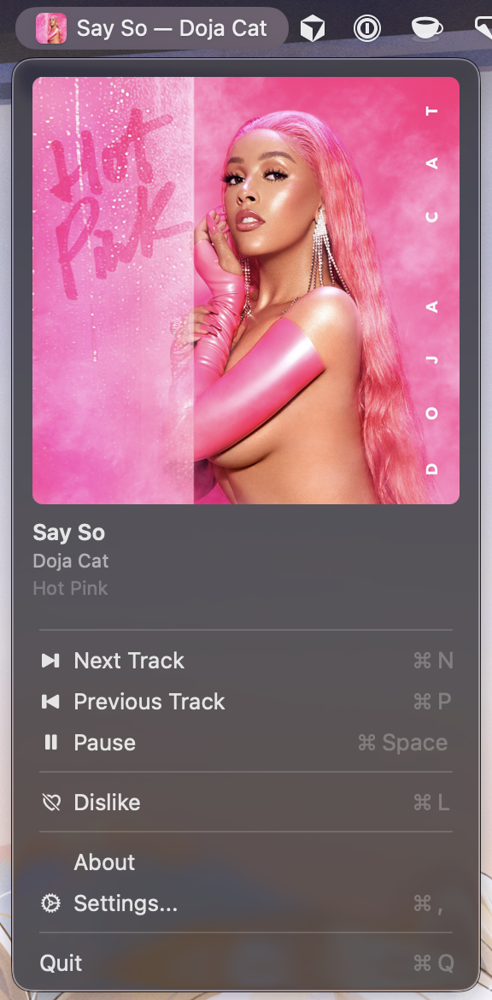

# MenuPlay

Spotify Now Playing in macOS menubar. A vibecoded app that shows album artwork and track info right in the menu bar.




## Features

- Album artwork + "Track — Artist" in the menu bar
- Dropdown menu with large artwork, track name, artist, and album
- Playback controls: Next, Previous, Play/Pause
- Like/Dislike via Spotify Web API
- Character limit setting for menu bar text
- Launch at login
- No external dependencies

## Spotify API setup (optional, for Like/Dislike)

1. Create an app at [developer.spotify.com/dashboard](https://developer.spotify.com/dashboard)
2. Add redirect URI: `menuplay://callback`
3. Copy the **Client ID**
4. In MenuPlay: Settings → paste Client ID → Connect to Spotify

## Releases

The release build is unsigned and not notarized, so macOS Gatekeeper may show a warning on first launch.

If macOS says the app is damaged, remove the quarantine attribute after unpacking the release:

```bash
xattr -rd com.apple.quarantine /Applications/MenuPlay.app
```

## Custom build

Requires macOS 13+ and Swift toolchain (Xcode Command Line Tools).

```bash
./scripts/build.sh
```

The app bundle will be at `build/MenuPlay.app`.

```bash
open build/MenuPlay.app
```
